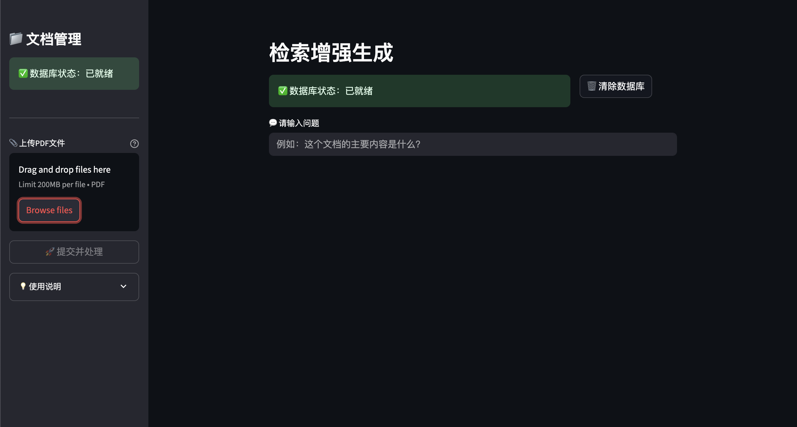
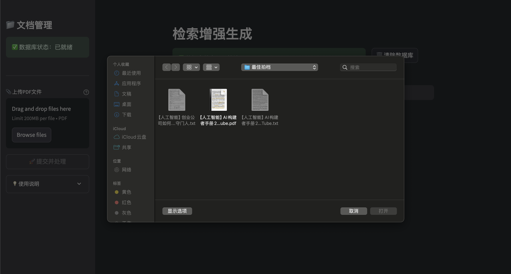
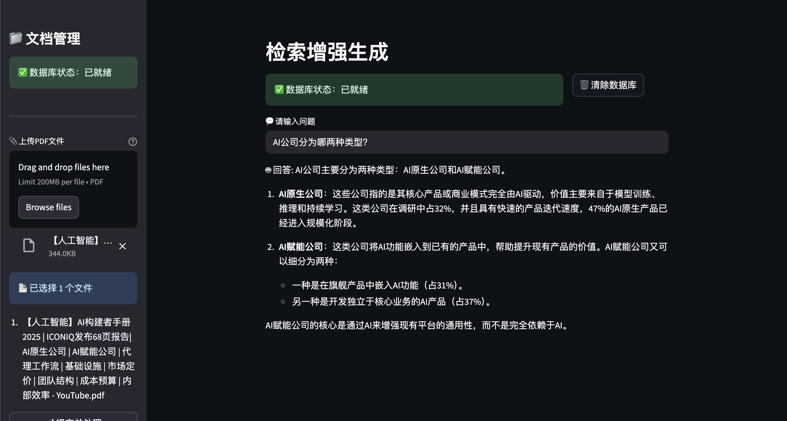

# 检索增强生成 (RAG) 系统

一个基于 LangChain 和 Streamlit 构建的智能文档问答系统，支持上传 PDF 文档并进行智能问答。

## ✨ 功能特性

- 📄 **PDF文档处理**: 支持上传多个PDF文件并自动解析文本内容
- 🔍 **智能检索**: 使用FAISS向量数据库进行高效的语义检索
- 🤖 **AI问答**: 基于OpenAI GPT-4o-mini模型，提供准确的文档问答
- 💬 **友好界面**: 基于Streamlit构建的直观Web界面
- 📊 **实时状态**: 显示数据库状态和处理进度
- 🗑️ **数据管理**: 支持清除数据库和重新处理文档

## 🚀 快速开始

### 环境要求

- Python >= 3.13
- OpenAI API Key

### 安装依赖

使用 uv 包管理器（推荐）：

```bash
# 克隆项目
git clone <your-repo-url>
cd LangChain

# 安装依赖
uv sync
```

### 环境配置

1. 创建 `.env` 文件并配置API密钥：

```env
OPENAI_API_KEY=your_openai_api_key_here
OPENAI_BASE_URL=https://api.openai.com/v1  # 或您的自定义API端点
```

### 运行应用

```bash
# 使用 uv
uv run streamlit run main.py

# 或使用 streamlit
streamlit run main.py
```

应用将在 `http://localhost:8501` 启动。

## �️ 运行效果展示

### 主界面
应用启动后，您将看到简洁直观的主界面：



**界面说明：**
- 🟢 **数据库状态指示器**: 显示当前向量数据库是否就绪
- 💬 **问题输入框**: 输入您想要询问的问题
- 🗑️ **清除数据库按钮**: 重置系统，清除已处理的文档数据
- 📁 **侧边栏文档管理**: 上传和处理PDF文件的控制面板

### 文件上传界面
通过侧边栏可以轻松上传PDF文档：



**上传功能：**
- 📎 **多文件支持**: 同时上传多个PDF文件
- 🔍 **文件预览**: 显示已选择的文件列表
- 📊 **文件限制**: 单个文件最大200MB，仅支持PDF格式
- 🚀 **一键处理**: 点击"提交并处理"开始文档解析和向量化

### 智能问答演示
上传文档并处理完成后，即可开始智能问答：



**问答特性：**
- 🤖 **基于文档内容**: AI严格根据上传的PDF内容回答问题
- 📝 **详细回答**: 提供结构化的详细答案，包含具体数据和分析
- 🎯 **准确检索**: 使用FAISS向量搜索确保答案的相关性
- ✅ **状态反馈**: 实时显示数据库状态和处理进度

**示例问答：**
- **问题**: "AI公司分为哪两种类型？"
- **回答**: AI根据文档内容详细说明了AI原生公司和AI赋能公司的区别，并提供了具体的数据支撑

## �📖 使用说明

### 步骤1: 上传PDF文档
1. 在侧边栏点击"📎 上传PDF文件"
2. 选择一个或多个PDF文件
3. 点击"🚀 提交并处理"按钮

### 步骤2: 开始问答
1. 等待文档处理完成（显示✅状态）
2. 在主页面输入框中输入您的问题
3. AI将基于文档内容为您提供答案

### 步骤3: 管理数据
- 可以上传新的PDF文件覆盖原有数据
- 点击"🗑️ 清除数据库"重新开始

## 🖼️ 运行效果展示

### 主界面
应用启动后，您将看到简洁直观的主界面：


**界面说明：**
- 🟢 **数据库状态指示器**: 显示当前向量数据库是否就绪
- 💬 **问题输入框**: 输入您想要询问的问题
- 🗑️ **清除数据库按钮**: 重置系统，清除已处理的文档数据
- 📁 **侧边栏文档管理**: 上传和处理PDF文件的控制面板

### 文件上传界面
通过侧边栏可以轻松上传PDF文档：


**上传功能：**
- 📎 **多文件支持**: 同时上传多个PDF文件
- 🔍 **文件预览**: 显示已选择的文件列表
- 📊 **文件限制**: 单个文件最大200MB，仅支持PDF格式
- 🚀 **一键处理**: 点击"提交并处理"开始文档解析和向量化

### 智能问答演示
上传文档并处理完成后，即可开始智能问答：


**问答特性：**
- 🤖 **基于文档内容**: AI严格根据上传的PDF内容回答问题
- 📝 **详细回答**: 提供结构化的详细答案，包含具体数据和分析
- 🎯 **准确检索**: 使用FAISS向量搜索确保答案的相关性
- ✅ **状态反馈**: 实时显示数据库状态和处理进度

**示例问答：**
- **问题**: "AI公司分为哪两种类型？"
- **回答**: AI根据文档内容详细说明了AI原生公司和AI赋能公司的区别，并提供了具体的数据支撑

## 🏗️ 项目架构

```
├── main.py              # 主应用文件
├── pyproject.toml       # 项目配置和依赖
├── uv.lock              # 依赖锁定文件
├── .env                 # 环境变量配置
├── docs/                # 文档和图片资源
│   └── images/          # 应用界面截图
│       ├── main_interface.png
│       ├── file_upload.png
│       └── qa_demo.png
├── faiss_db/            # FAISS向量数据库存储目录
│   ├── index.faiss      # 向量索引文件
│   └── index.pkl        # 元数据文件
└── README.md            # 项目说明文档
```

## 🔧 核心技术

- **LangChain**: 用于构建AI应用的框架
- **FAISS**: Facebook AI相似性搜索库，用于向量检索
- **OpenAI Embeddings**: text-embedding-3-large模型用于文本向量化
- **GPT-4o-mini**: 用于智能问答的语言模型
- **Streamlit**: 用于构建Web界面
- **PyPDF2**: 用于PDF文档解析

## 🛠️ 主要组件

### 文档处理模块
```python
def pdf_read(pdf_doc)      # PDF文档解析
def get_chunks(text)       # 文本分块处理
def vector_store(chunks)   # 向量数据库创建
```

### 问答系统模块
```python
def get_conversational_chain()  # 对话链配置
def user_input()               # 用户输入处理
```

### 工具集成
- **检索工具**: 基于FAISS的文档检索
- **代理执行器**: LangChain Agent用于工具调用和推理

## ⚙️ 配置选项

### 文本分块参数
- `chunk_size`: 1000 (每个文本块的大小)
- `chunk_overlap`: 200 (文本块之间的重叠)

### 模型配置
- **Embedding模型**: text-embedding-3-large
- **LLM模型**: gpt-4o-mini
- **向量数据库**: FAISS

## 📝 许可证

本项目采用 MIT 许可证 - 查看 [LICENSE](LICENSE) 文件了解详情。

## ❓ 常见问题

### Q: 为什么上传PDF后无法提问？
A: 请确保点击了"🚀 提交并处理"按钮，等待处理完成后再提问。

### Q: 支持哪些文件格式？
A: 目前只支持PDF格式的文档。

### Q: 如何更换AI模型？
A: 修改 `main.py` 中的 `init_chat_model` 参数即可。

### Q: 向量数据库存储在哪里？
A: 数据存储在项目目录下的 `faiss_db` 文件夹中。

**Made with ❤️ using LangChain & Streamlit**
